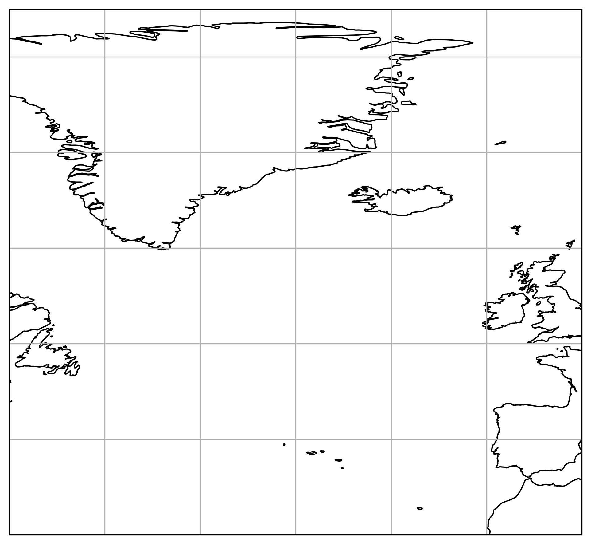

# Microphysical Parameter Choices Modulate Ice Content and Relative Humidity in the Outflow of a Warm Conveyor Belt

📘 **Reproducibility repository for our 2025 publication:**

> *"Microphysical parameter choices modulate ice content and relative humidity in the outflow of a warm conveyor belt"*  
> DOI (preprint): [10.5194/egusphere-2025-1816](https://doi.org/10.5194/egusphere-2025-1816)

---

## 🧩 Overview

This repository contains the **code, configuration, and analysis scripts** used to reproduce the results presented in the publication listed above.

All analysis is performed using **Julia**, and the main plotting and analysis routines can be found in the `CODE/` directory.

The repository provides:
- Reproducible workflows for the data analysis in the paper  
- Functions for model calculations, statistical analysis, and plotting  
- Scripts to recreate the figures presented in the publication  

---

## 🚀 Getting Started

### 1. Prerequisites

- [Julia](https://julialang.org/downloads/) (version ≥ 1.9 recommended)
- Optional: access to the ERA5 dataset (required for Figure 1)

### 2. Setup

Unzip or clone this repository and navigate into the project directory:

```bash
git clone git@github.com:CornelisSchwenk/PPE.git
cd PPE
```

Install required Julia packages:

```bash
julia --project=. install_packages.jl
```

Then start the Julia REPL:

```bash
julia --project=.
```

---

## 📊 Reproducing the Figures

After launching Julia with the correct project environment:

```julia
include("create_plots.jl")
```

Then create the figures by running:

```julia
plot_Fig2(true)
plot_Fig3(true)
# ... and so on for Fig4–Fig16, FigA1, SI1–SI7
```

> **Note:** Figure 1 requires access to ERA5 data and is therefore not included.

---

## 🧠 Script Reference

| File | Description |
|------|--------------|
| `general_plots.jl` | Core plotting utilities used across figures |
| `plotting_functions.jl` | Definitions of plotting functions used in the paper |
| `create_plots.jl` | Defines the figure routines for the paper |
| `do_analysis_*.jl` | Perform trajectory and statistical analyses to produce processed `.nc` files |
| `model.jl` | Defines random forest models used in the paper |
| `calcs.jl` | Common constants, calculations, and module imports |
| `statistical_functions.jl` | Statistical measures and metrics |
| `thermodynamic_functions.jl` | Thermodynamic functions used in the analysis |
| `use_config.jl` | Loads common packages for Julia REPL sessions |
| `cartopy_background.py` | Python helper for generating background maps with borders |
| `slurmfiles/` | Example output directory for batch jobs on HPC clusters |

---

## 💾 Data Overview

The `DATA/` directory contains both trajectory data and derived NetCDF files used in the analysis:

| File | Created by | Description |
|------|-------------|--------------|
| `PPE_vars_all.nc` | `do_analysis_all.jl` | Main processed dataset |
| `PPE_vars_end_hours.nc` | `do_analysis_after_hours.jl` | Data filtered by end hours |
| `PPE_vars_accum.nc` | `do_analysis_accum.jl` | Accumulated statistics |
| `PPE_vars_accum_hours.nc` | `do_analysis_accum_hours.jl` | Accumulated hourly data |
| `PPE_vars_t600.nc` | `do_analysis_t600.jl` | Results filtered at 600 hPa |

Run these scripts individually to regenerate data (requires sufficient memory):

```bash
julia --project=. do_analysis_all.jl
```

Optionally, use multithreading:

```bash
julia --project=. --threads X do_analysis_all.jl
```

> ⚠️ Some scripts require minor code edits to enable multithreading.  
> Use at your own risk—memory-intensive runs may cause bus errors on small systems.

---

## 📄 Additional Notes

- `params.txt` — lists the perturbed parameters used in the PPE ensemble.  
- External data from *Oertel (2025)* related to this study can be found at  
  [https://doi.org/10.35097/ecgs4f56mp3ymjmt](https://doi.org/10.35097/ecgs4f56mp3ymjmt)

---

## 🧑‍💻 Citation

If you use this code or build upon this work, please cite the paper:

> Schwenk, C., et al. (2025): *Microphysical parameter choices modulate ice content and relative humidity in the outflow of a warm conveyor belt.*  
> *EGUsphere Discussions*, [https://doi.org/10.5194/egusphere-2025-1816](https://doi.org/10.5194/egusphere-2025-1816)

---

## 📬 Contact

**Cornelis Schwenk**  
Email: *add your email if desired*  
GitHub: [@CornelisSchwenk](https://github.com/CornelisSchwenk)

---

## 🪪 License

You can include a license of your choice here, for example:

```
MIT License
Copyright (c) 2025 Cornelis Schwenk
```

---


